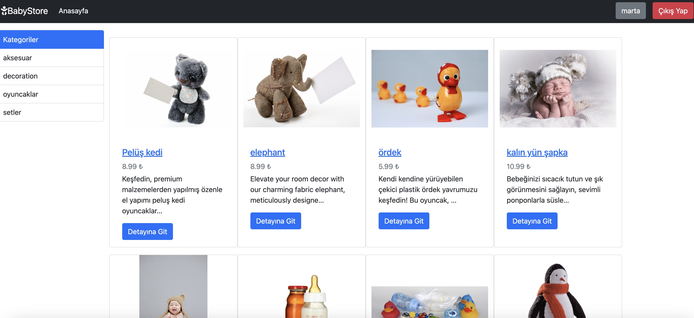
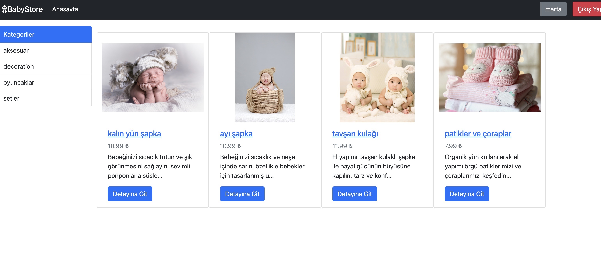
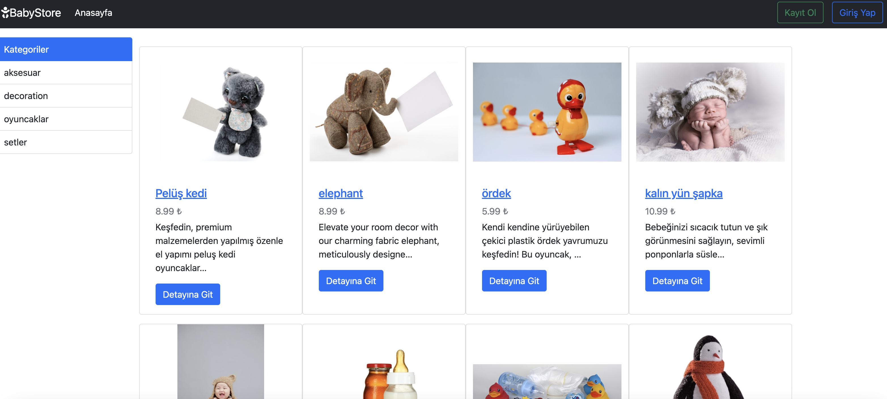

# E-Commerce Project For Baby Tools

## Table of Contents

1. [Description](#description)
2. [Technologies](#technologies)
3. [Quickstart](#quickstart)
4. [Usage](#usage)
5. [Media](#media)
6. [Docker](#docker)
7. [Notes](#notes)
8. [Photos](#photos)

## Description

This repository contains an e-commerce project for baby tools developed with Django 4.0.2 and Python 3.9. The goal is to provide a platform where users can browse, purchase, and manage baby products. It includes features such as product filtering, detail views, user registration, and login.

## Technologies

- Python 3.9
- Django 4.0.2
- Venv

## Quickstart

### Prerequisites

- Python 3.9 installed
- Virtual environment (`venv`) set up
- Docker installed and running on the system

### Quickstart Guide

1. **Clone the repository:**

    ```sh
    git clone https://github.com/MartaNaranjoEipperle/baby-tools-shop.git
    cd baby-tools-shop
    ```

2. **Create and activate the virtual environment:**

    ```sh
    python -m venv venv
    source venv/bin/activate   # On Windows: venv\Scripts\activate
    ```

3. **Generate `requirements.txt` based on installed packages:**

    ```sh
    pip freeze -l > requirements.txt
    ```

4. **Install dependencies from `requirements.txt`:**

    ```sh
    pip install -r requirements.txt
    ```

5. **Apply Django migrations:**

    ```sh
    python manage.py migrate
    ```
6. **Create a `.env` file:**

    Create a `.env` file in the root of your project with the following content:

    ```plaintext
    DJANGO_SECRET_KEY=your_secret_key
    DATABASE_PASSWORD=your_database_password
    DATABASE_NAME=your_database_name
    DATABASE_USER=your_database_user
    DATABASE_HOST=your_database_host
    DATABASE_PORT=your_database_port
    DEBUG=True
    ```

    **Note:** Make sure the `.env` file is listed in your `.gitignore` file to avoid committing it to your repository.

7. **Start the development server:**

    ```sh
    python manage.py runserver
    ```

    Open your browser and go to `http://127.0.0.1:8000` to view the application.

## Usage

### Configuration

- Django settings and configurations are located in `babyshop_app/babyshop/settings.py`. Here, you can modify database settings, installed apps, and middleware, for example.

- To add template directories (`templates`), we added the following paths under `DIRS` in the settings:
    ```python
    TEMPLATES = [
        {
            ...
            'DIRS': [
                os.path.join(BASE_DIR, 'templates'),
                os.path.join(BASE_DIR, 'products'),
            ],
            ...
        },
    ]
    ```
    This change allows Django to search additional directories for templates (HTML files), allowing us to store templates centrally in `templates` and specifically for products in `products`.

### Adjusting Routes

- Routing information can be found in `babyshop_app/babyshop/urls.py`. Here are the changes we made:

- **views.py**:
  ```python
  from django.shortcuts import render

  def index(request):
      # Logic for the index view goes here
      return render(request, 'index.html')
    ```

- **urls.py**:
    ```python
    from django.urls import path
    from . import views

    urlpatterns = [
        path('', views.index, name='index'),
    ]
    ```

## Media

- I created a directory named `media` under `babyshop_app/babyshop/media` to store images and other media files.

- To populate the media directory, I logged in to the admin page (`/admin`) and added products with categories and descriptions. These actions populated the `media` directory with photos.

## Docker

- **Dockerfile**: The Dockerfile is available in the root directory of this repository. It describes the configuration to build a Docker image that runs the application. You can use it to isolate and run your application in a Docker environment.

    Here's an example Dockerfile content for your Django application:

    ```dockerfile
    FROM python:3.10-alpine

    ARG WORKDIR=/app
    ARG PORT=8025

    WORKDIR ${WORKDIR}

    COPY requirements.txt .

    RUN pip install --upgrade pip && \
    pip install -r requirements.txt

    COPY . .

    WORKDIR /app/babyshop_app

    RUN python manage.py makemigrations && \ 
        python manage.py migrate && \
        python manage.py collectstatic

    EXPOSE ${PORT}

    ENV DJANGO_SECRET_KEY=${DJANGO_SECRET_KEY}
    ENV DATABASE_PASSWORD=${DATABASE_PASSWORD}

    ENTRYPOINT ["python", "manage.py"]

    CMD ["runserver", "0.0.0.0:8025"]
    ```

## Creating a Docker Volume

After building the Docker image (`babyshop`), create a Docker volume named `babyshop_db` to persist the database data.

```sh
docker volume create babyshop_db
```

## Running the Docker Container

Run the Docker container using the following command:

```sh
docker run -p 8025:8025 -v babyshop_db:/app/db --name babyshop -d babyshop
```

## Build the Docker Image

Build the Docker image using the following command:

```sh
docker build -t babyshop .
```

## Notes

This section provides some important tips for interacting with this repository:

- Settings and configurations for Django can be found in `babyshop_app/babyshop/settings.py`.
- Routing information is located in the file `babyshop_app/babyshop/urls.py`.

## Photos

### Home Page with Login



### Home Page with Filter



### Product Detail Page


### Home Page without Login



### Register Page


### Login Page


