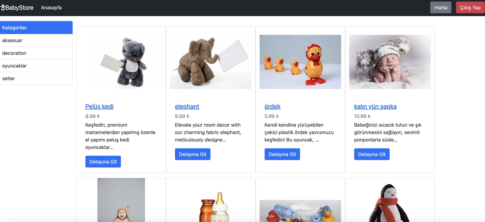
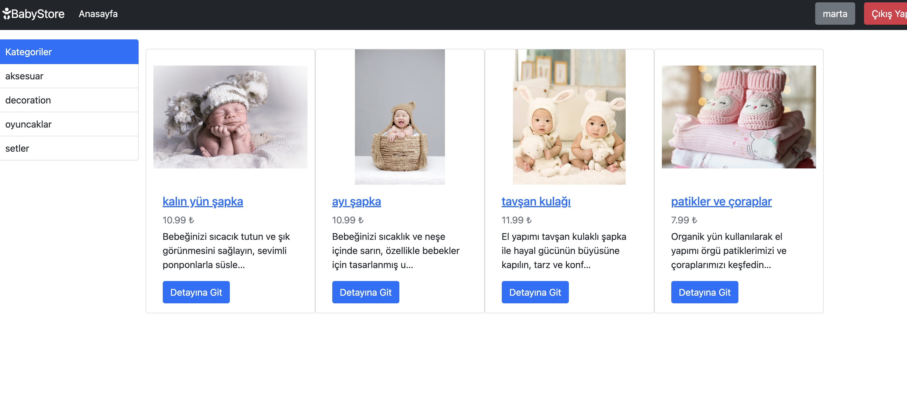
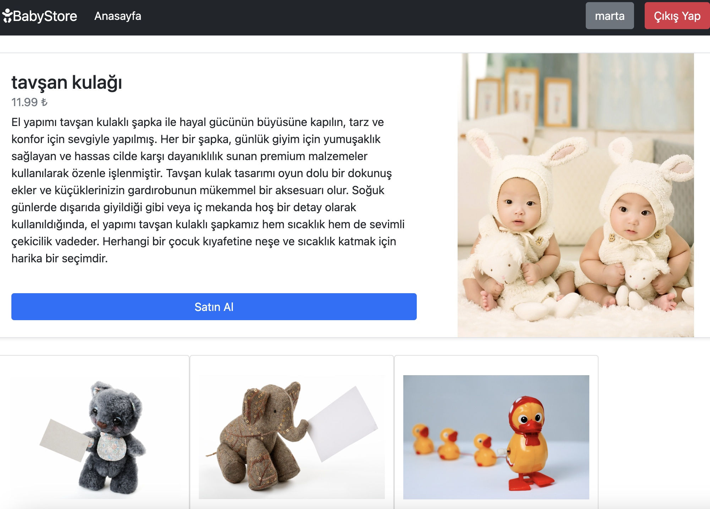
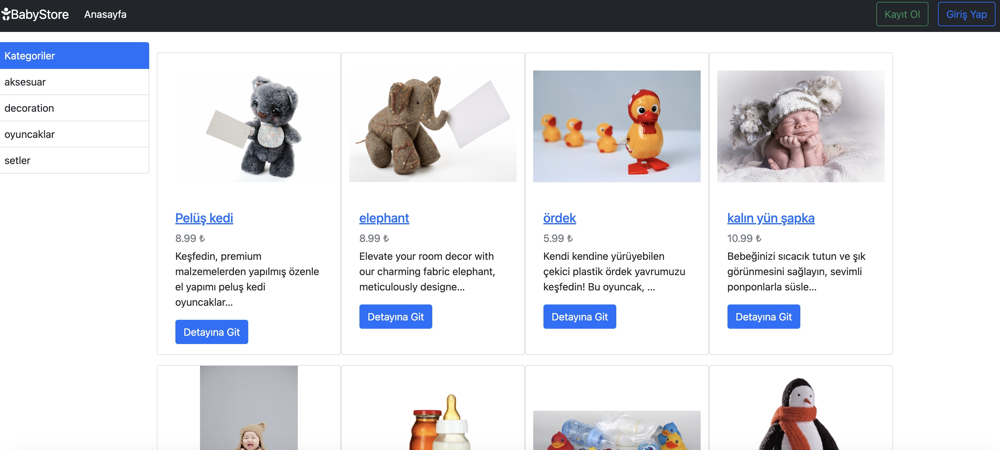

# E-Commerce Project For Baby Tools

## Table of Contents

1. [Description](#description)
2. [Technologies](#technologies)
3. [Quickstart](#quickstart)
4. [Docker](#docker)
5. [Notes](#notes)
6. [Photos](#photos)

## Description

This repository contains an e-commerce project for baby tools developed with Django 4.0.2 and Python 3.9. The goal is to provide a platform where users can browse, purchase, and manage baby products. It includes features such as product filtering, detail views, user registration, and login.

## Technologies

- Python 3.9
- Django 4.0.2
- Venv

## Quickstart

### Prerequisites

- Python 3.9 installed
- Virtual environment (`venv`) set up
- Docker installed and running on the system

### Quickstart Guide


1. **Create and activate the virtual environment:**

    ```sh
    python -m venv venv
    source venv/bin/activate   # On Windows: venv\Scripts\activate
    ```

2. **Generate `requirements.txt` based on installed packages:**

    ```sh
    pip freeze -l > requirements.txt
    ```

3. **Install dependencies from `requirements.txt`:**

    ```sh
    pip install -r requirements.txt
    ```

4. **Apply Django migrations:**

    ```sh
    python manage.py migrate
    ```
5. **Create a `.env` file:**

    Create a `.env` file in the root of your project with the following content:

    ```plaintext
    DJANGO_SECRET_KEY=your_secret_key
    DATABASE_PASSWORD=your_database_password
    DATABASE_NAME=your_database_name
    DATABASE_USER=your_database_user
    DATABASE_HOST=your_database_host
    DATABASE_PORT=your_database_port
    DEBUG=True
    ```

    **Note:** Make sure the `.env` file is listed in your `.gitignore` file to avoid committing it to your repository.

6. **Start the development server:**

    ```sh
    python manage.py runserver
    ```

    Open your browser and go to `http://127.0.0.1:8000` to view the application.

7. **Create superuser:**

    To create a superuser for accessing the Django admin interface and managing your application:

    ```sh
    python manage.py createsuperuser
    ```

    Follow the prompts to enter a username, email address, and password for the superuser.

    After creating the superuser, you can access the Django admin interface by starting the development server:

    ```sh
    python manage.py runserver
    ```

    Then, open your browser and go to [http://127.0.0.1:8000/admin/](http://127.0.0.1:8000/admin/) to log in with the superuser credentials and manage your application data.


## Docker

- **Dockerfile**: The Dockerfile is available in the root directory of this repository. It describes the configuration to build a Docker image that runs the application. You can use it to isolate and run your application in a Docker environment.


    ```dockerfile
    FROM python:3.10-alpine

    ARG WORKDIR=/app
    ENV PORT=8025

    WORKDIR ${WORKDIR}

    COPY requirements.txt .

    RUN pip install --upgrade pip && \
        pip install -r requirements.txt

    COPY . .

    WORKDIR /app/babyshop_app

    RUN python manage.py makemigrations && \ 
        python manage.py migrate && \
        python manage.py collectstatic

    EXPOSE ${PORT}

    ENV DJANGO_SECRET_KEY=${DJANGO_SECRET_KEY}
    ENV DATABASE_PASSWORD=${DATABASE_PASSWORD}

    ENTRYPOINT ["python", "manage.py"]

    CMD ["runserver", "0.0.0.0:${PORT:-8025}"]
    ```

## Creating a Docker Volume

After building the Docker image (`babyshop`), create a Docker volume named `babyshop_db` to persist the database data.

```sh
docker volume create babyshop_db
```

## Running the Docker Container

Run the Docker container using the following command:

```sh
docker run 
-p 8025:8025 
-v babyshop_db:/app/db 
--name babyshop 
-d 
--rm 
babyshop:08_07_2024
```
### Description of Each Part

- **`docker run`**: 
  This command starts a new Docker container from a specified image.

- **`-p 8025:8025`**:
  Maps port 8025 on the host to port 8025 in the container. This is useful for accessing services in the container from outside, such as a web application or a database.

- **`-v babyshop_db:/app/db`**:
  Binds the volume `babyshop_db` on the host to the `/app/db` directory in the container. This allows data to persist between container restarts and ensures that the database data is retained.

- **`--name babyshop`**:
  Assigns the name `babyshop` to the container. This makes it easier to manage and reference the container in future commands.

- **`-d`**:
  Runs the container in detached mode, meaning it runs in the background and does not block the terminal.

- **`--rm`**:
  Automatically removes the container when it stops. This is useful for saving space and avoiding unnecessary containers.

- **`babyshop:08_07_2024`**:
  Specifies the `babyshop` image with the tag `08_07_2024` to use for starting the container. The tag helps to distinguish between different versions of the image.


## Build the Docker Image

Build the Docker image using the following command:

```sh
docker build -t babyshop:08_07_2024 .
```

## Notes

This section provides some important tips for interacting with this repository:

- Settings and configurations for Django can be found in `babyshop_app/babyshop/settings.py`.
- Routing information is located in the file `babyshop_app/babyshop/urls.py`.

## Photos

### Home Page with Login



### Home Page with Filter



### Product Detail Page 



### Home Page without Login



### Register Page


### Login Page


